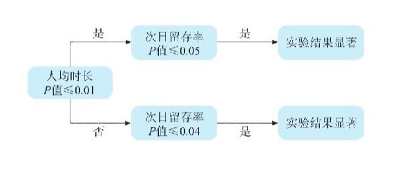
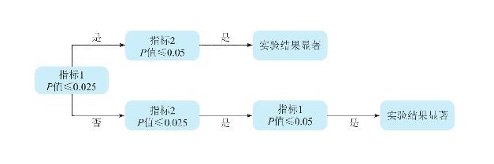

## AB实验
一个AB实验，用户人均时长分别为$t_A$,$t_B$  
假设检验：  
$H_0$： $t_A$ = $t_B$ $\rightarrow$ A和B没有区别  
$H_1$： $t_A$ $\neq$ $t_B$ $\rightarrow$ A和B没有区别  
显著性水平 $\alpha$ 多小的概率算是小概率  
犯错误的概率低于$\alpha$，就说明小概率事件发生了 $\rightarrow$ 拒绝$H_0$

实验基本假定是，实验分为实验组A和对照组B，实验组A在新策略作用下人均时长为tA，对照组B在老策略作用下人均时长为tB。实验设计者想知道新策略对比老策略，人均时长究竟有没有提升。下面尝试用假设检验的方法来解答。  
原假设$H_0$：A组相对B组的用户，人均时长没有显著差异。  
$t_A$ = $t_B$ $\rightarrow$ $\Delta$$t_{AB}$=$t_A$ - $t_B$=0。  
备择假设$H_1$：A组相对B组的用户，人均时长有显著差异。  
$t_A$ $\neq$ $t_B$，等价于$\Delta$$t_{AB}$=$t_A$ - $t_B$ $\neq$ 0。  
注意，这里时长$t_A$、$t_B$指的是总体用户，而实际得到的是做实验时抽样样本的数据指标$\overline{t_A}$，$\overline{t_B}$，于是问题转变为： 

$\Delta$t = $\overline{t_A}$ - $\overline{t_B}$  
 
P值是小概率事件发生的实际概率，如果P值<显著性水平$\alpha$，则认为小概率事件发生了，拒绝原假设$H_0$  
其中，$\alpha$是人为规定的，p和t有对应关系，求p就变成了求t
$$Z=\frac{\bar{X_{1}}-\bar{X_{2}}}{\sqrt{\frac{S_{1}}{n_{1}}+\frac{S_{2}}{n_{2}}}}$$

第一类错误：弃真错误  假阳性  
第二类错误：取伪错误  假阴性

为了控制第二类错误，引入一个概念——功效（power）。  
功效是指当$H_0$不成立时，做出拒绝$H_0$的结论正确的概率。功效=1-第二类错误发生的概率β，即功效越大，第二类错误发生的概率越小。功效越大，第三类错误发生的概率也越小，基本会趋近于0。（第三种错误就是实验组和对照组的差异反了，应该是实验组效果更好的结果是对照组更好，一般比较少遇到）  

结合P值，基本判断流程如下。  
如果P值<α，则拒绝原假设$H_0$，认为策略有效。  
如果P值≥α，不能拒绝原假设$H_0$，也不能接受H1，此时不能说策略有效，但是也不能说策略无效。需要进一步观察功效，如果功效>80%（一般选择80%），说明犯第二类错误的概率也很低了，即策略有效却被判断为无效的概率很低，此时策略大概率就是无效的。如果功效<80%，此时策略有效却被判断为无效的概率还是比较大的。策略有可能是真的没效果，那么怎么办呢？这就需要继续观察实验，直到P值或者功效达到可以判断。  
本质上就是希望通过一些手段（如增加样本容量等）增加Z值，进而达到某个可以作出拒绝原假设$H_0$的临界值。Z值的计算中，只有两个变量可以操作，一个是样本数量n，另一个是方差σ 。可以通过增加n或者减少方差σ去增加z，从而拒绝$H_0$。这个过程就是通过增加样本量或者降低方差来提升检验精度。  

参数检验要求符合独立同分布，非参数的方法对总体概率没有分布的要求，不对模型做任何参数假设，完全是基于数据模拟的方法。目前使用最多的是bootstrap（有放回）和jackknife（无放回）

## 多重测试：  
产生原因：
- 多次重复进行相同的实验
- 多次进行相同对比
- 实验进行过程中多次查看实验结果，即常说的实验偷窥
- 同一个实验有多个指标的情况

控制多重测试问题  

最常用的是Bonferroni法，其基本原理是：若进行n次检验，显著性水平（检验水准）α应校正为α/n，或将P值乘以n后再与α比较。比如，某AB实验具有3个指标，采用Bonferroni法进行多重性校正后的检验水准α=0.05/3=0.0167。
Bonferroni法的实践用法和变种：
1. Fallback法  
以一个信息流实验为例，该实验关注的结果指标有两个——用户人均使用时长和次日留存率。由于该实验具有两个结果指标，因此采用Bonferroni法，在双侧α=0.05的水平上控制总体第一类错误率，但总体第一类错误率在不同指标之间进行了不均匀分配。

2. Holm法

注意这里的指标1和指标2一般是有先后顺序的，在检验指标2之前先检验指标1。

3. 这里还有一个简单的经验法则。  
- 将所有指标分成3组：一阶指标，那些预计会受到实验影响的指标；二阶指标，那些可能会受到影响的指标；三阶指标，那些不太可能受到影响的指标。  
- 对每一组应用分级显著性水平（例如，分别为0.05、0.01和0.001）。

为了保证实验评估结果的准确性，还需要实验参与单元满足一定的假设条件，比如个体处理稳定性假设

## 实验参与单元

1. 元素级别 interleaving算法：用户会收到算法a和算法b混合的推荐
2. 页面级别 web常用
3. 会话级别 启用到结束为一个会话/切后台30分钟为一个会话
4. 用户级别

## SUTVA
（Stable UnitTreatment Value Assumption，个体处理稳定性假设）
如何解决sutva不成立的情况：
1. 建立监控和报警
2. 隔离法：共享资源隔离，地理位置隔离，网络族群隔离
3. 边缘度分析
4. 生态经验法
5. 双边随机化

对于一个AB的实验。  
- 第一类错误不超过5%，即α≤5%。
- 第二类错误不超过20%，即1-β≥80%

## SRM指标的计算
虽然导致SRM问题的原因很多，但最终影响实验分析结果时，都是通过实验组和对照组实验参与单元的可比性来实现的。当采样比例指标的P值较低时（一般低于0.001时），应该假定大概率是系统中的某个地方存在错误。  
6.3.1

## AA实验
因为AA实验的两个组的策略完全一样，只有实验参与人群不同，所以我们可以运用AA实验来做以下的事情：
1. 控制第一类错误；
2. 确保用户同质，即确保实验组和对照组用户之间具有可比性，不存在实验以外的其他差异；
3. 数据指标对齐，评估指标的可信度和可变性；
4. 估计统计方差。  

## 降低方差的方法
使用分层、控制变量或使用实验前数据（Controlled-experiment Using Pre-Experiment Data，CUPED）等方法也能降低方差  
分层抽样：多数应用程序使用后期分层，即在分析阶段回溯应用分层；分层抽样之后还是容易出现不均的状况，比如高活用户占比不均，需要赋予权重重新计算高活和低活，将ab两组的总人均指标修改为一致

# 如何评估长期实验效果
## 反转实验
在反转实验中，我们在对100%的用户启动实验几周（或几个月）后，将10%的用户重新加入对照。这种方法的好处是，每个人都接受了一段时间的实验。如果实验引入网络效应，或者市场供应受到限制，则反转实验允许网络或市场时间达到新的均衡。这种方法的缺点是，如果实验可能会带来明显的变化，那么将用户重新放回对照组可能会让他们感到困惑。

## 后期分析法
在后期分析法中，在实验运行一段时间（比如时间T）后关闭实验，在时间T和T+1期间测量实验组和对照组的用户之间的差异，该方法的一个关键点是，在(T,T+1)期间，实验组和对照组的用户都暴露于完全相同的特征。

## 时间交错法
通俗解释就是AA实验里的AA分别在T0和T1开始进行实验，AA之间的区别是实验持续时间不同  
这种方法假设两组实验之间的差异随着时间的推移而变小。换句话说，T1(t)-T0(t)是t的递减函数。  
在实践中，还需要确保两个交错处理之间有足够的时间间隔，用户有一定时间的学习成本。